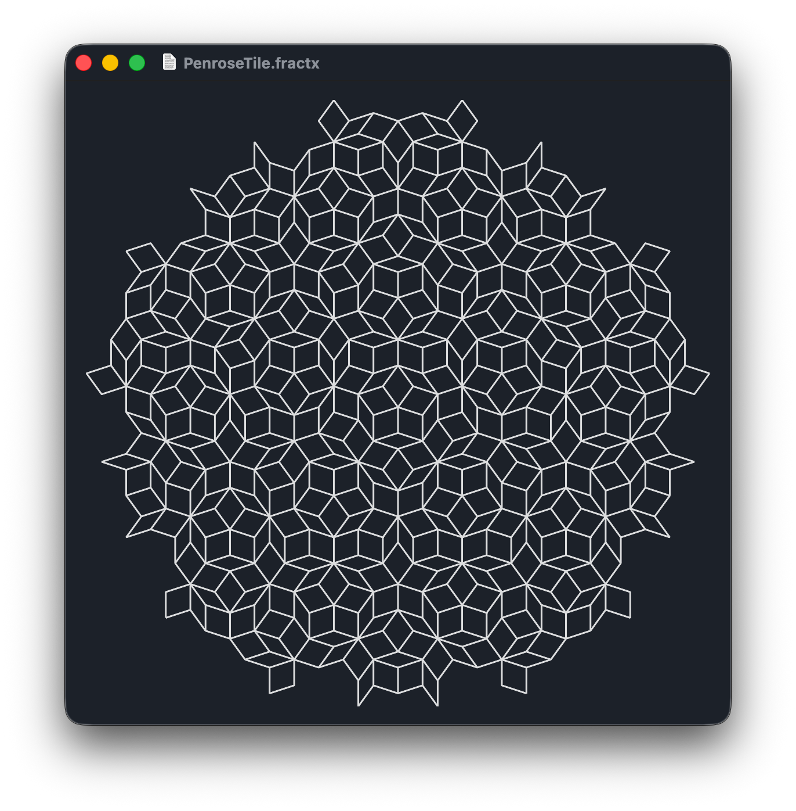

# L-Systems in Swift

This repository contains the sample code for the presentation _On L-Systems_, delivered to CocoaHeads x Swift Language User Group meetup on January 8, 2026.

The project contains an implementation of L-Systems and Logo-style "Turtle graphics," along with a simple SwiftUI app, "L-System Designer" that allows graphing and editing of L-Systems.

The Sample Documents directory contains a variety of L-Systems for you to explore.